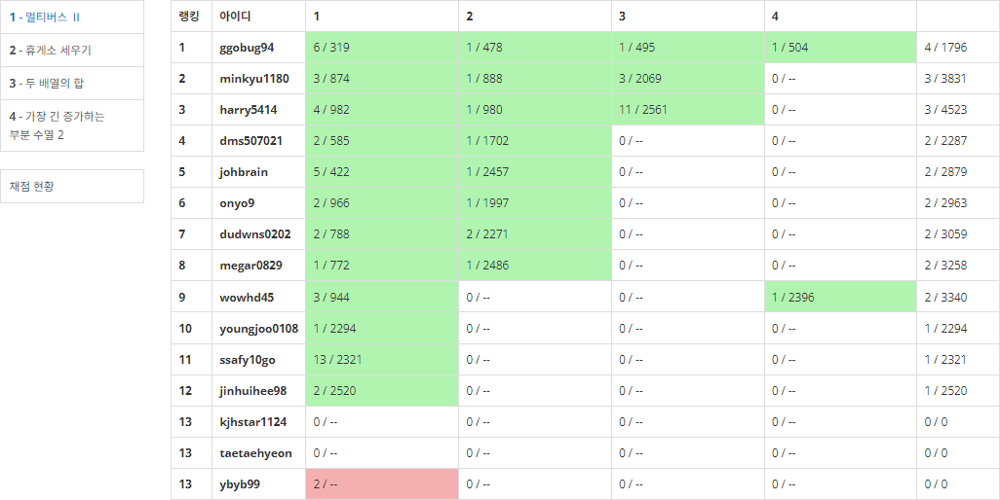
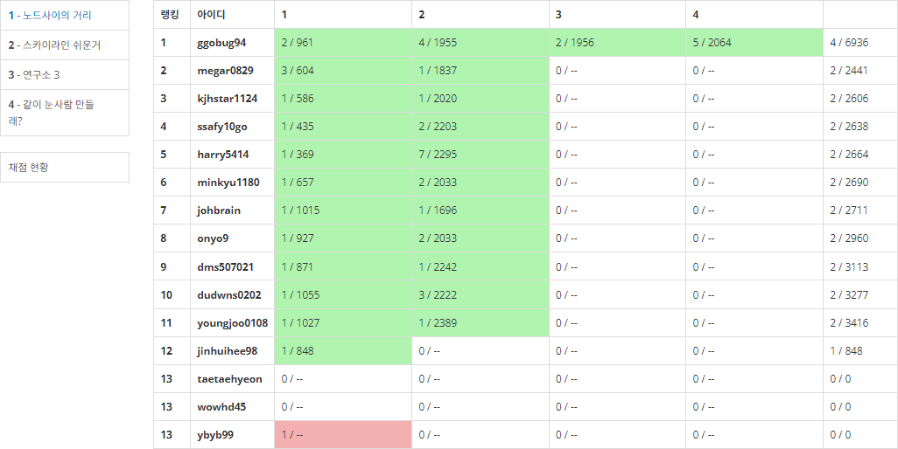
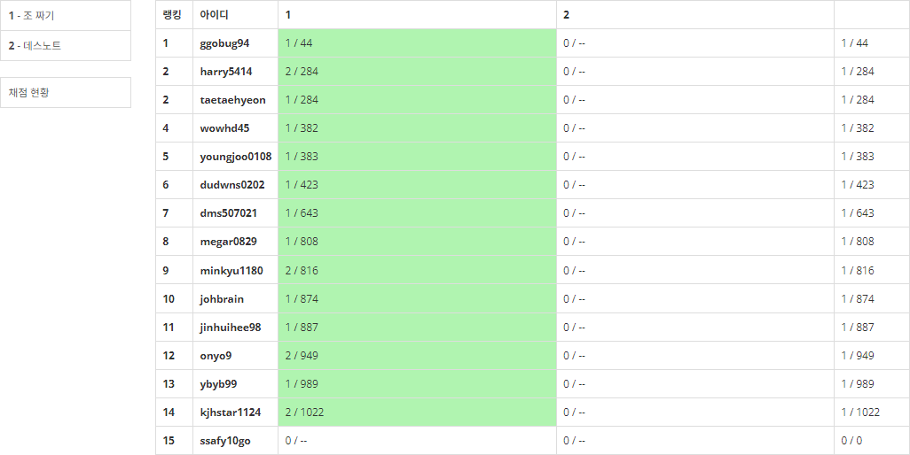

## 2023년 10월 잔디가득심기 스터디 결과 보고서

### 스터디 운영 결과

#### 스터디 운영 성과

- `2023. 10` 삼성 SW 역량테스트 **A형 4명 추가 취득**, 현재 누적 **11명 취득(78%)**
- `2023. 10` 10월 평균 문제 풀이 : **32.8** / 66문제 
- `2023. 10` 잔디 가득 심기(스트릭 유지) : **11명** / 15명

#### 스터디 운영 느낀점

- 10월 12일, 삼성 SW 역량테스트 A형 응시로 4명의 추가 합격자가 나왔다! 절대적인 실력의 척도는 아니지만, 많은 문제를 겪어보고 꽤 높은 수준의 문제를 통과했다는 점에서 유의미하다고 생각한다 :) 또한, 백준 티어 플래티넘을 달성한 스터디원도 생겼다! 이 스터디 유지로 인해 점점 성장해나감에 뿌듯하다는 생각이 든다.

- 시험 응시까지 알고리즘 커리큘럼과 비슷하게 1일 4문제를 출제해왔으나, 다른 커리큘럼 병행과 공채기간 등 할 일이 많아지면서 문제 자체를 낭비하게 되는 경우가 많이 발생했다.

- 이를 해결하기 위해, 문제 수준을 높여 매일 고민해볼 만한 문제를 푸는 것에 의의를 두고 1일 1솔로 계획을 변경했다.

- 4문제 중 1문제를 푸는 것보다 2문제 중 1문제를 푸는 것이 성취도 또한 더 높게 다가오는 것 같다!

- 이러한 조치에도 불구하고, 바빠진 커리큘럼에 스트릭 자체를 유지하지 못하는 경우가 발생했다. 꽤나 신경써서 문제를 출제하는 나 입장에서는 10월 3주는 스트릭 유지가 깨지고 문제 푸는 갯수가 줄어드는 것을 확인한 꽤나 씁쓸한 주간이었다. 즉, 벌금 제도만으로는 이 약속이 지켜지지 않는 것이 불편했다.

- 10월 23일, 이러한 현상을 방지하기 위해 2 strike out 제도를 도입했다. 또한, 2시간 정도 고민해보고도 풀지 못하는 경우에는 구글링 또는 스터디원의 도움을 받아 문제를 푸는 방법을 도입하기로 결정했다. 이후 현재까지는 스트릭이 정상적으로 유지되고 있는 상태이다.

- 이 알고리즘 스터디는 내가 보람차기 위해서 유지하는 스터디가 아니다. 그렇기 때문에 스트릭 유지로 자기 자신만의 동기 부여를 갖기 위해 스터디 목표를 스트릭 유지로 설정했었다. 그렇다고 해서 스트릭을 유지하지 않을 때 내가 스트레스를 받지 않는 건 아니었다. 스터디 자체를 관리하는 입장에서는 다른 사람의 동기 부여를 흐리는 사람이 되어버린다고 생각했다. 따라서 강력한 수를 두었고, 이 방법이 계속해서 유지되어 스스로가 문제 푸는 원동력이 되기를 희망한다.

  

### 스터디 운영 계획

#### 참석명단 (현 15명)

- 스터디장 : `조용훈`

- 스터디원 : `권원영` `김대원` `김민규` `김태현` `김영준` `김재형` `배정식` `송영주` `윤예빈` `이재종` `장진희` `최현기` `홍지은` `황준식`

#### 스터디 목표

- 백준(solved.ac ) 스트릭 유지

- 1일 1솔 (백준 티어 골드 수준)

#### 활동 계획

- 학습 도구 : [백준](https://www.acmicpc.net/), [솔브드](https://solved.ac/)
- 코딩테스트 대비, 알고리즘 분류를 감안하지 않고 코딩 테스트 유사 문제를 풀이
- 어떤 문제를 풀더라도, 구체적인 알고리즘 풀이 방식을 설명하는 주석 삽입

#### 페널티 제도 (10월 23일 부)

- streak break : 3,000원
- 공통 풀이 문제 미풀이 : 2,000원
- 2 strike out 
  - 월 1회 streak break : Yellow card
  - two Yellow card : Red card, Out

#### 운영 계획 변경 사항

1. 벌금 제도 변경, 스터디명 취지에 맞게 잔디 심기에 우선 순위를 둠.

   - 기존안
     - 잔디 탈모 : 3,000원
     - 평일 2문제 미풀이 : 2,000원
     - 평일 1문제 미풀이 : 1,000원
     - 주말 1문제 미풀이 : 2,000원
   - 변경안 (10월 23일 부)
     - streak break : 3,000원
     - 공통 풀이 문제 미풀이 : 2,000원
     - 2 strike out 
       - 월 1회 streak break : Yellow card
       - two Yellow card : Red card, Out

2. 문제 제출 형태 변경 (10월 12일 부)

   

   - 백준 티어 골드 수준 1일 1솔 목표로 변경
   - 1일 평균 4문제 출제 → 1일 평균 2문제 출제 (문제 낭비 방지)

#### 잔디 심기 현황 (10. 4. ~ 10. 30. / 27일)

###### 권원영

- 10월 문제 풀이 : 33문제
- 10월 스트릭 유지 : **FULL(27일)**

###### 김대원

- 10월 문제 풀이 : 41문제
- 10월 스트릭 유지 : **FULL(27일)**

###### 김민규

- 10월 문제 풀이 : 37문제
- 10월 스트릭 유지 : **FULL(27일)**

###### 김영준

- 9월 문제 풀이 : 33문제
- 9월 스트릭 유지 : **FULL(27일)**

###### 김재형

- 10월 문제 풀이 : 17문제
- 10월 스트릭 유지 : 10일

###### 김태현 (10월 25일 합류)

- 10월 문제 풀이 : 16문제
- 10월 스트릭 유지 : 7일

###### 배정식

- 10월 문제 풀이 : 37문제
- 10월 스트릭 유지 : **FULL(27일)**

###### 송영주

- 10월 문제 풀이 : 37문제
- 10월 스트릭 유지 : **FULL(30일)**

###### 이재종

- 10월 문제 풀이 : 30문제
- 10월 스트릭 유지 : **FULL(27일)**

###### 윤예빈 (10월 5일 합류)

- 10월 문제 풀이 : 29문제
- 10월 스트릭 유지 : 8일

###### 장진희

- 10월 문제 풀이 : 27문제
- 10월 스트릭 유지 : 18일

###### 조용훈

- 9월 문제 풀이 : 35문제
- 9월 스트릭 유지 : **FULL(27일)**

###### 최현기

- 9월 문제 풀이 : **63문제**
- 9월 스트릭 유지 : **FULL(27일)**

###### 홍지은

- 9월 문제 풀이 : 31문제
- 9월 스트릭 유지 : **FULL(27일)**

###### 황준식

- 9월 문제 풀이 : 26문제
- 9월 스트릭 유지 : **FULL(27일)**

### 진행 일정 및 공부한 내용

#### 전체 연습 내역 (66문제 출제)

- `10/4(수) ~ 10/9(월)` [Test Exrc] BOJ 22문제 출제

  - `10/4(수)` `1.69 / 4` 문제 풀이

    

  - `10/5(목)`  `1.77 / 4` 문제 풀이

    

  - `10/6(금)`  ` 2.21 / 4` 문제 풀이

    

  - `10/7(토) ~ 10/9(월)` `4.07 / 10` 문제 풀이

    

- `10/10(화) ~ 10/12(목)` [A형 대비] BOJ 12문제 출제

  - `10/10(화)`  ` 1.21 / 4` 문제 풀이

    

  - `10/11(수)` ` 0.93 / 4` 문제 풀이

    

  - `10/12(목)` `1.08 / 4` 문제 풀이

    

- `10/13(금) ~ 10/20(금)` [Binary Search] BOJ 16문제 출제

  - `10/13(금)` `0.86 / 2` 문제 풀이

    

  - `10/14(토) ~ 10/15(일)` `1.79 / 4` 문제 풀이

    

  - `10/16(월)` `1.29 / 2` 문제 풀이

    

  - `10/17(화)` `1.14 / 2` 문제 풀이

    

  - `10/18(수)` `1.26 / 2` 문제 풀이

    

  - `10/19(목)` `1.21 / 2` 문제 풀이

    

  - `10/20(금)` `0.71 / 2` 문제 풀이

    

- `10/21(토) ~ 10/25(수)` [Gold] BOJ 8문제 출제

  - `10/21(토) ~ 10/22(일)` `1.76 / 4` 문제 풀이

    

  - `10/23(월)` `1.36 / 2` 문제 풀이

    

  - `10/25(수)` `1.47 / 2` 문제 풀이

    

- `10/24(화) ~ 10/30(월)` [DP] BOJ 12문제 출제

  - `10/24(화)` `1.36 / 2` 문제 풀이

    

  - `10/26(목)` `1.47 / 2` 문제 풀이

    

  - `10/27(금)` `1 / 2` 문제 풀이

    

  - `10/28(토) ~ 10/29(일)` `2.2 / 4` 문제 풀이

    

  - `10/30(월)` `0.93 / 2` 문제 풀이

    