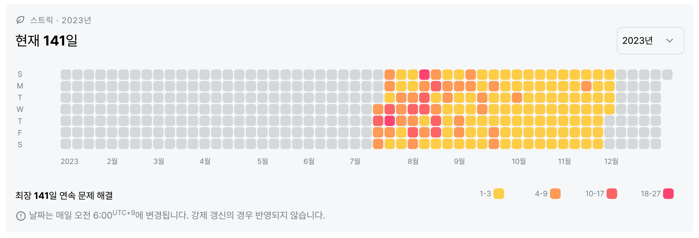
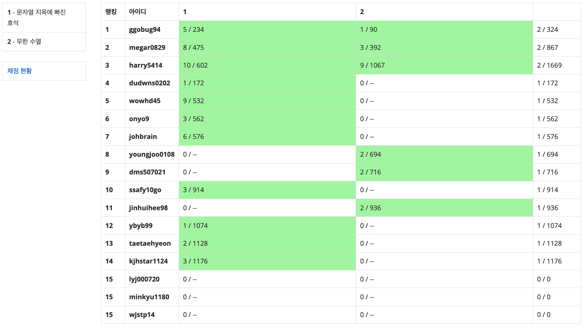

## 2023년 11월 잔디가득심기 스터디 결과 보고서

### 스터디 운영 결과

#### 스터디 운영 성과

- `2023. 11` 기업 코딩테스트 합격 : **2명**
- `2023. 11` 11월 평균 문제 풀이 : **.** / 50문제 
- `2023. 11` 잔디 가득 심기(스트릭 유지) : **12명** / 15명

#### 스터디 운영 느낀점

- 11월은 SQLD 자격증 시험과 SSAFY 1학기 공통 프로젝트 기간이 겹쳐서 현실적으로 알고리즘 문제 풀이가 어려운 한 달이었다.

- 최대한 시간을 내어 문제를 풀려고 노력했지만, 1일 1문제로 줄이면서 문제 수준이 높아진 만큼 적은 시간을 들여서 문제 푸는 것은 어려웠다. 다른 사람도 마찬가지였겠지만 대충 고민해보고 안풀리면 풀이를 찾아보기에는 나중에 다시 풀어볼 수 있는 문제라고 생각한다면 아쉬웠기에 벌금을 내고 스트릭 유지만 하게 되었다.

- 그만큼 바빴지만 감사하게도 대부분의 스터디원들이 매일 문제 풀이를 했기에 스터디 또한 계속해서 유지할 수 있었던 것 같다. 그 결과 몇몇 스터디원들의 기업 코딩 테스트 합격이라는 결실도 맺을 수 있었다.

- SSAFY에서 깔아준 판에서 온라인 스터디를 운영하다 보니 이런 보고서를 쓰고 있는데, 한 달에 한 번 우리 스스로를 돌아보는 시간은 꽤나 많은 성과를 남기고 있다는 것을 깨우친다는 점에서 유익하다고 생각한다.(보고서 쓰는데 거의 2시간 정도를 사용하는 내 입장에서는 꽤 귀찮기는 하지만...)

- 이제 학기가 끝나면서 SSAFY에서 지원해주지는 않겠지만, 모두가 기업 코딩테스트에 합격하고 최종 합격을 하는 순간까지 알고리즘 스터디를 유지해볼 생각이다. 계속 언급해왔지만, 문제를 찾는 과정에서 문제 유형에 대해 깊이 이해할 수 있었고, 양질의 문제를 계속 경험할 수 있기 때문이다.

- 그리고, 단지 알고리즘 문제 풀이 역량만 키우는 것이 아니라, 그 과정에서 프로그래밍 언어에 점점 더 익숙해지고, 웹 개발 하는 과정에서도 문제 해결에 많은 도움이 되고 있다고 생각한다. 

- 나처럼 우리 스터디원들도 모두 도움이 되었으면 좋겠고, 벌써 4개월째 유지하고 있는 이 스터디가 만들어낼 결실이 궁금해진다. 못해도 1년! 제대로 운영해보겠습니다!

  

### 스터디 운영 계획

#### 참석명단 (현 15명)

- 스터디장 : `조용훈`

- 스터디원 : `권원영` `김대원` `김민규` `김태현` `김영준` `김재형` `배정식` `송영주` `윤예빈` `이재종` `장진희` `최현기` `홍지은` `황준식`

#### 스터디 목표

- 매일 알고리즘 문제풀이 습관 기르기

- 백준(solved.ac ) 스트릭 유지

- 1일 1솔 (백준 티어 골드 수준)

#### 활동 계획

- 학습 도구 : [백준](https://www.acmicpc.net/), [솔브드](https://solved.ac/)
- 코딩테스트 대비, 알고리즘 분류를 감안하지 않고 코딩 테스트 유사 문제를 풀이
- 어떤 문제를 풀더라도, 구체적인 알고리즘 풀이 방식을 설명하는 주석 삽입

#### 페널티 제도

- streak break : 3,000원
- 공통 풀이 문제 미풀이 : 2,000원
- 2 strike out 
  - 월 1회 streak break : Yellow card (2개월 후 소멸)
  - two Yellow card : Red card, Out

#### 잔디 심기 현황 (10. 31. ~ 11. 29. / 30일)

###### 권원영

- 11월 문제 풀이 : 30문제
- 11월 스트릭 유지 : **FULL(30일)**

###### 김대원

- 11월 문제 풀이 : 34문제
- 11월 스트릭 유지 : **FULL(30일)**

###### 김민규

- 11월 문제 풀이 : 29문제
- 11월 스트릭 유지 : **FULL(30일)**

###### 김영준

- 11월 문제 풀이 : 29문제
- 11월 스트릭 유지 : **FULL(30일)**

###### 김재형

- 11월 문제 풀이 : 27문제
- 11월 스트릭 유지 : **FULL(30일)**

###### 김태현 (10월 25일 합류)

- 10월 문제 풀이 : 31문제
- 10월 스트릭 유지 : **FULL(30일)**

###### 배정식

- 11월 문제 풀이 : 33문제
- 11월 스트릭 유지 : **FULL(30일)**

###### 송영주

- 11월 문제 풀이 : 31문제
- 11월 스트릭 유지 : **FULL(30일)**

###### 이재종

- 11월 문제 풀이 : 34문제
- 11월 스트릭 유지 : **FULL(30일)**

###### 윤예빈

- 11월 문제 풀이 : 26문제
- 11월 스트릭 유지 : 15일

###### 장진희

- 11월 문제 풀이 : 30문제
- 11월 스트릭 유지 : **FULL(30일)**

###### 조용훈

- 11월 문제 풀이 : 25문제
- 11월 스트릭 유지 : **FULL(30일)**

###### 최현기

- 11월 문제 풀이 : **42문제**
- 11월 스트릭 유지 : 18일

###### 홍지은

- 11월 문제 풀이 : 30문제
- 11월 스트릭 유지 : 22일

###### 황준식

- 11월 문제 풀이 : 24문제
- 11월 스트릭 유지 : **FULL(30일)**

### 진행 일정 및 공부한 내용

#### 전체 연습 내역 (50문제 출제)

- [DP] BOJ 6문제 출제

  - `10/31(화)` `1.6 / 2` 문제 풀이

    

  - `11/14(화)`  `1.07 / 2` 문제 풀이

    

  - `11/20(월)`  ` 1 / 2` 문제 풀이

    

- [Simulation] BOJ 5문제 출제

  - `11/1(수)`  ` 1.13 / 2` 문제 풀이

    

  - `11/17(금)` `1 / 2` 문제 풀이

    

  - `11/23(목)` `0.6 / 1` 문제 풀이

    

- [Graph] BOJ 11문제 출제

  - `11/2(목)` `1.13 / 2` 문제 풀이

    

  - `11/4(토) ~ 11/5(일)` `2.2 / 3` 문제 풀이 

    

  - `11/13(월)` `1.13 / 2` 문제 풀이

    

  - `11/15(수)` `1 / 2` 문제 풀이

    

  - `11/27(월)` `1 / 2` 문제 풀이

    

- [Dijkstra] BOJ 2문제 출제

  - `11/3(금)` `1.27 / 2` 문제 풀이

    

- [String] BOJ 4문제 출제

  - `11/6(월)` `1 / 2` 문제 풀이

    
  
  
    - `11/7(화)` `1.07 / 2` 문제 풀이
  
      
  

- [Greedy] BOJ 7문제 출제

  - `11/8(수)` `1.2 / 2` 문제 풀이

    

  - `11/16(목)` `0.87 / 2` 문제 풀이

    

  - `11/18(토) ~ 11/19(일)` `1.87 / 3` 문제 풀이

    

- [Brute Force] BOJ 7문제 출제

  - `11/10(금)` `0.93 / 2` 문제 풀이

    

  - `11/11(토) ~ 11/12(일)` `1.67 / 3` 문제 풀이

    

  - `11/21(화)` `0.87 / 2` 문제 풀이

    

- [Hash] BOJ 4문제 출제

  - `11/9(목)` `0.93 / 2` 문제 풀이

    

  - `11/22(수)` `0.93 / 1` 문제 풀이

    

  - `11/24(금)`  `0.8 / 1` 문제 풀이

    

- [Heap] BOJ 2문제 출제

  - `11/25(토) ~ 11/26(금)` `1.8 / 2` 문제 풀이

    

- [Trie] BOJ 2문제 출제

  - `11/28(화)` `1 / 1` 문제 풀이

    

  - `11/29(수)` `0.93 / 1` 문제 풀이

    