## 2023년 8월 잔디가득심기 스터디 결과 보고서

### 참석명단

- 스터디장 : `조용훈`

- 스터디원 : `김대원` `김재형` `송영주` `이재종` `장진희` `홍지은` `황준식`
- 추가인원 : `권원영` `김민규` `김영준` `배정식` `최현기` `황지환`

### 진행 일정 및 공부한 내용

- `8/1(화) ~ 8/7(월)` [List] BOJ 29문제 출제 

  - `8/1(화)`

    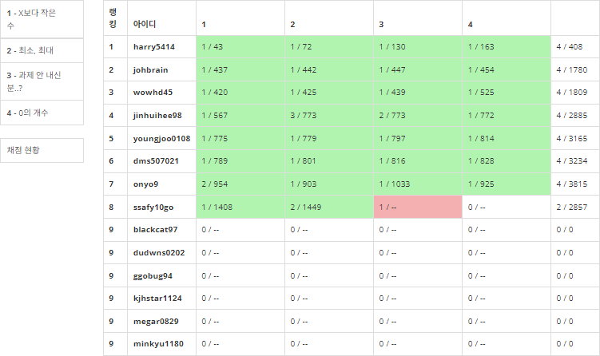

  * `8.2.(수)`

    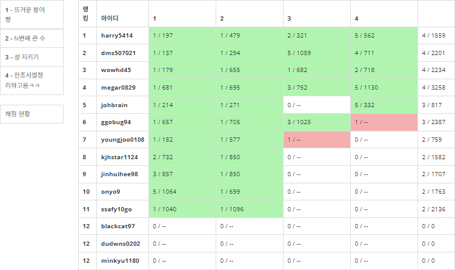

  * `8/3(목)`

    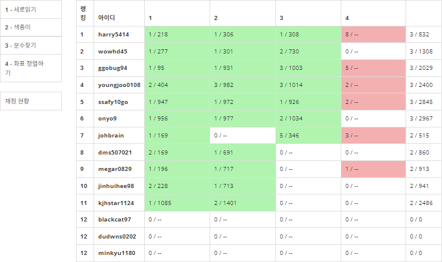

  * `8/4(금)`

    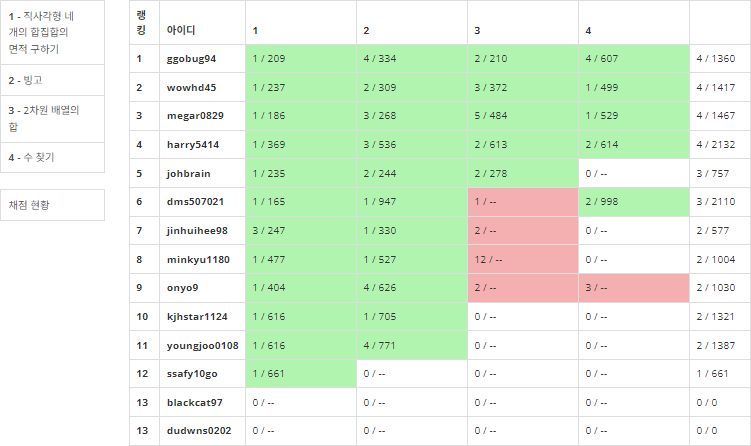

  * `8/5(토) ~ 8/6(일)`

    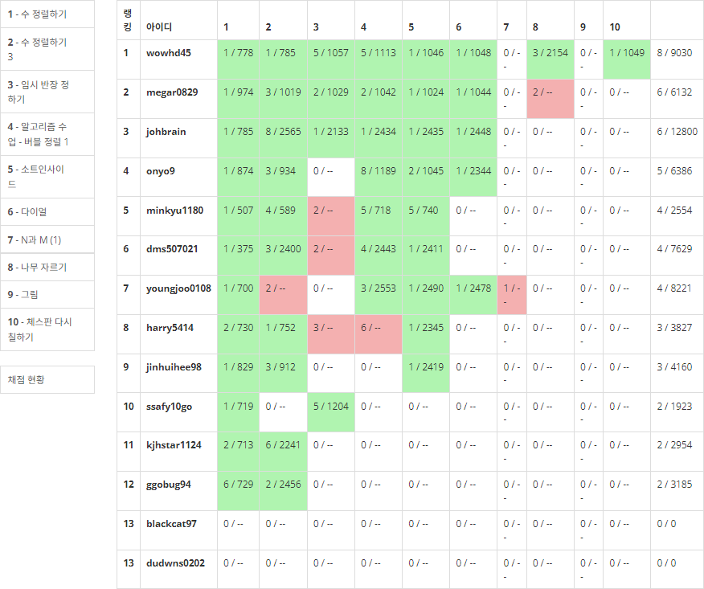

  * `8/7(월)`

    

    

- `8/8(화) ~ 8/9(수)` [String] BOJ 8문제 출제

  - `8/8(화)`

    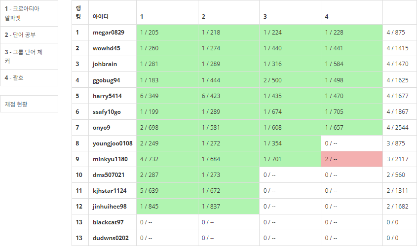

  - `8/9(수)`

    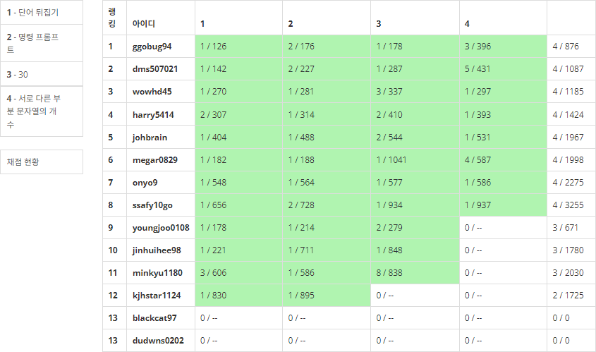

    

- `8/10(목) ~ 8/11(금)` [Stack] BOJ 11문제 출제

  - `8/10(목)`

    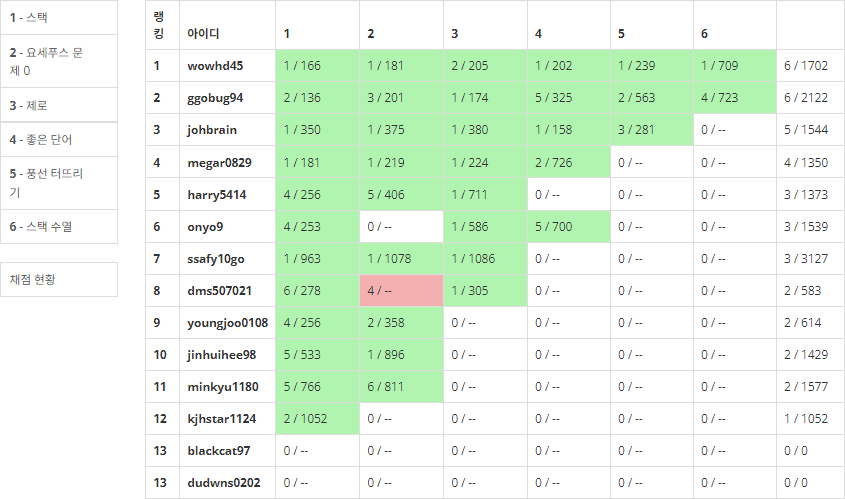

  - `8/11(금)`

    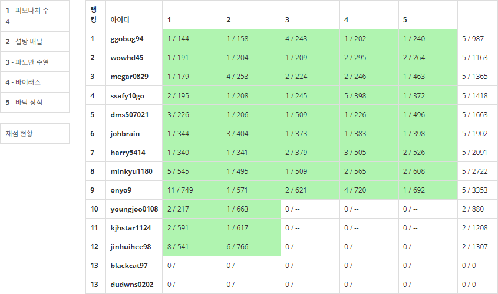

    

- `8/12(토) ~ 8/14(월)` [String, Stack] BOJ 15문제 출제

  - `8/12(토) ~ 8/13(일)`

    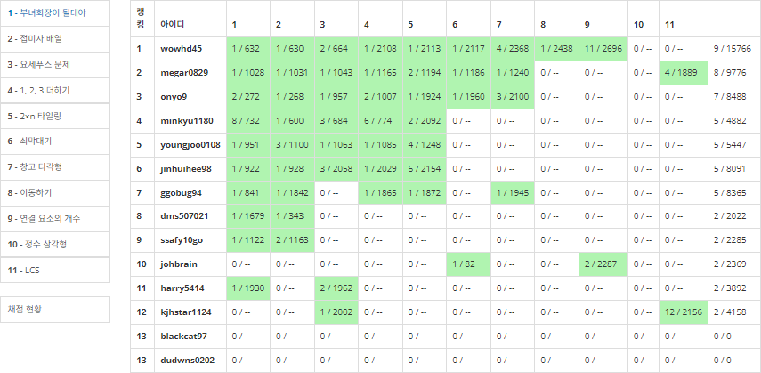

  - `8/14(월)`

    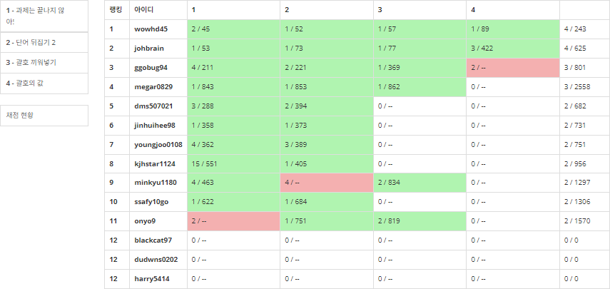

    

- `8/15(화) ~ 8/17(목)` [Stack] BOJ 13문제 출제

  - `8/15(화) ~ 8/16(수)`

    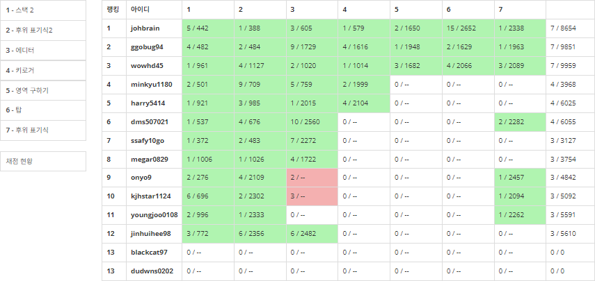

  - `8/17(목)`

    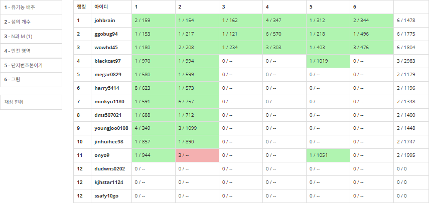

    

- `8/18(금)` [Queue] BOJ 6문제 출제

  - `8/18(금)`

    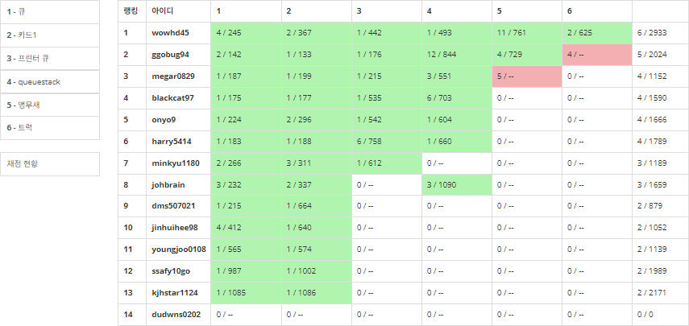

    

- `8/19(토) ~ 8/21(월)` [Stack, Queue] BOJ 18문제 출제

  - `8/19(토) ~ 8/20(일)`

    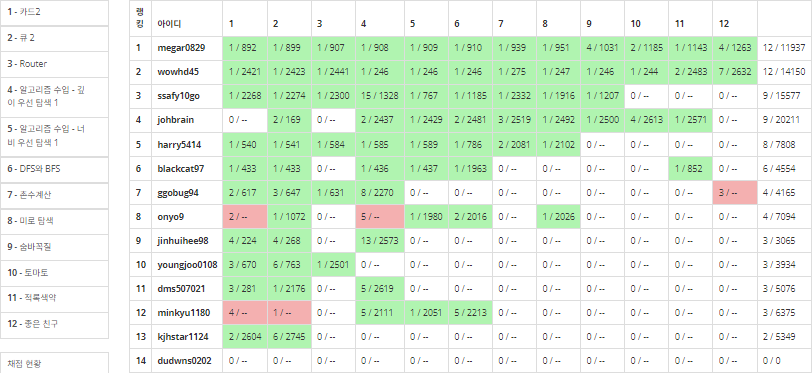

  - `8/21(월)`

    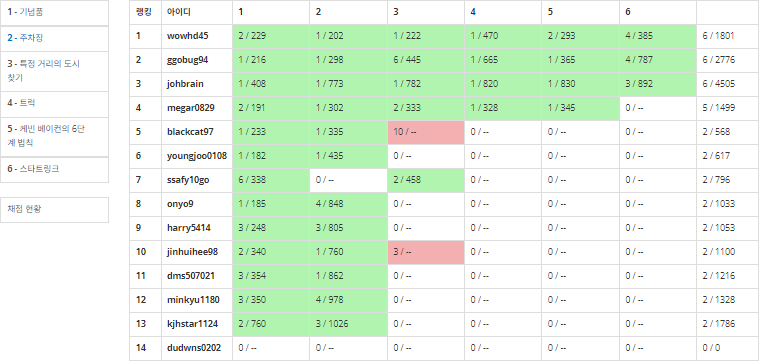

    

- `8/22(화) ~ 8/23(수)` [Tree] BOJ 8문제 출제

  - `8/22(화)`

    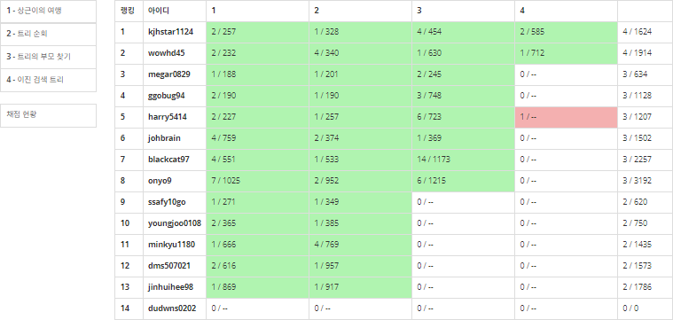

  - `8/23(수)`

    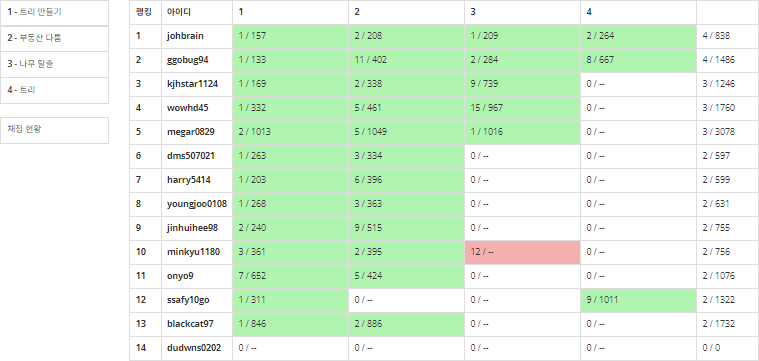

    

- `8/24(목) ~ 8/28(월)` [삼성 SW 역량테스트 IM형 대비] BOJ 26문제 출제

  - `8/24(목) ~ 8/27(일)`

    

  - `8/28(월)`

    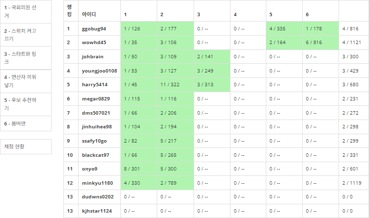

    

- `8/29(화) ~ 8/30(수)` [Simulation] BOJ 11문제 출제

  - `8/29(화)`

    

  - `8/30(수)`

    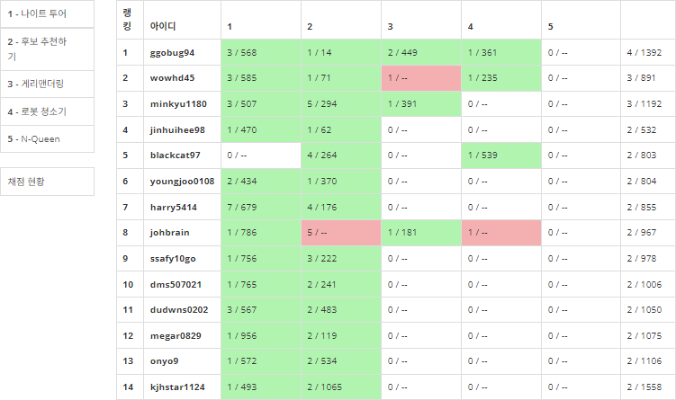

    

- `8/31(목)` : [Brute Force] BOJ 5문제 출제

  - `8/31(목)`

    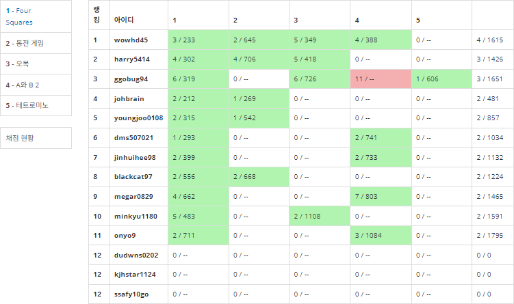

### 잔디 심기 현황

#### 김대원

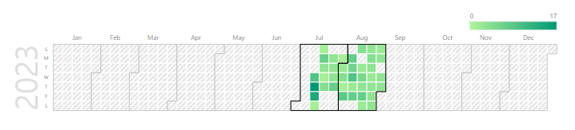

#### 김재형

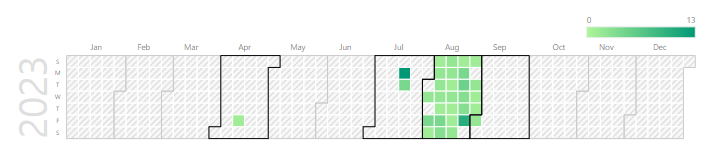

#### 송영주

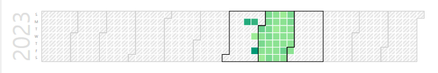

#### 이재종

#### 장진희

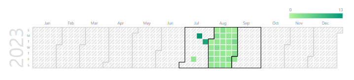

#### 조용훈

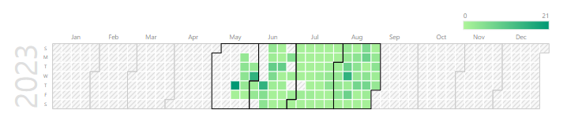

#### 홍지은

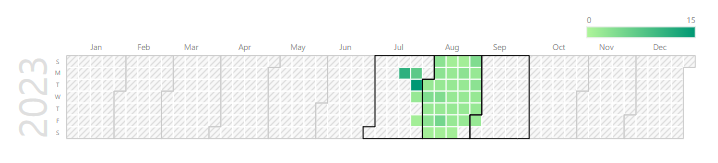

#### 황준식

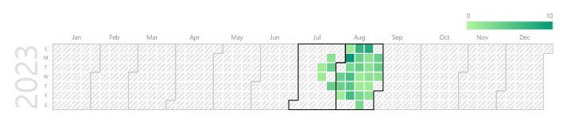

#### 권원영 (8/2 합류)

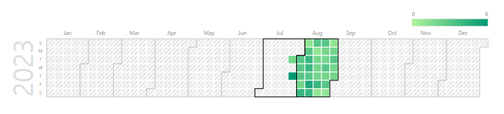

#### 배정식 (8/2 합류)

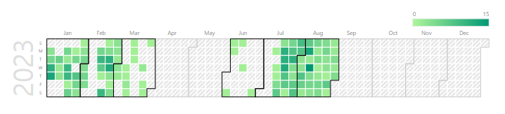

#### 최현기 (8/2 합류)

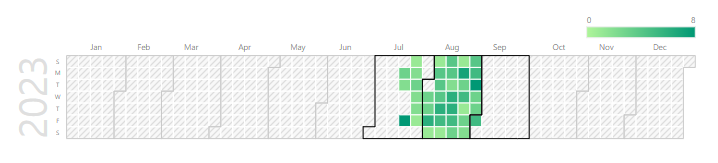

#### 김민규 (8/4 합류)

#### 황지환 (8/18 합류)

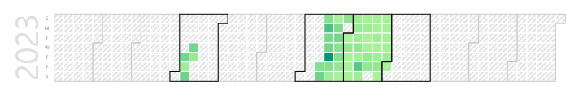

#### 김영준 (8/29 합류)

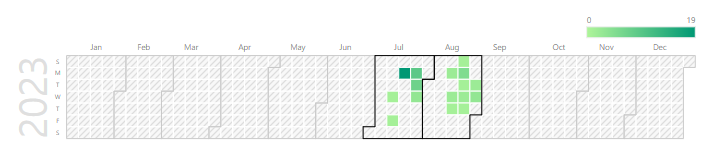