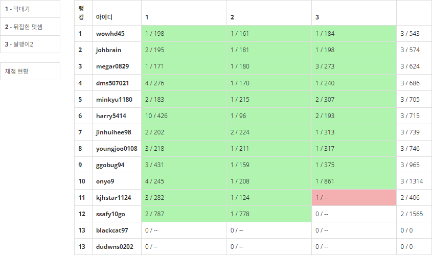
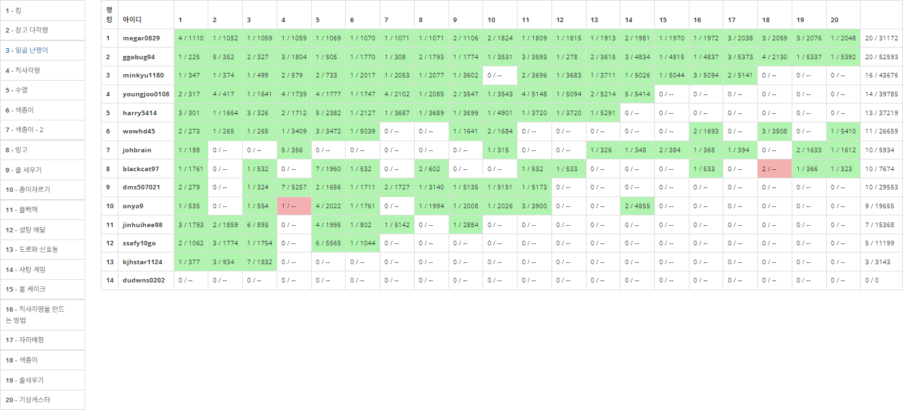
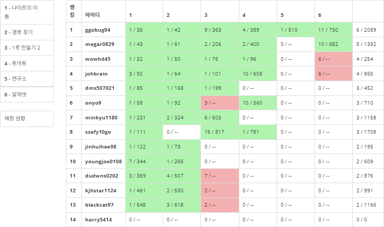
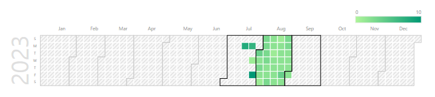
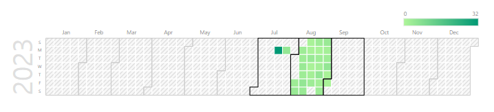
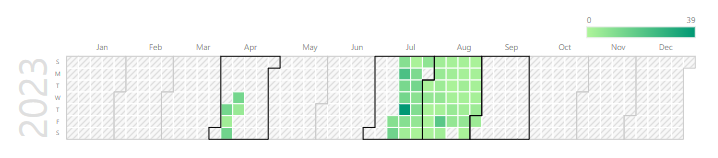

## 2023년 8월 잔디가득심기 스터디 결과 보고서

### 스터디 운영 계획

#### 참석명단

- 스터디장 : `조용훈`

- 스터디원 : `김대원` `김재형` `송영주` `이재종` `장진희` `홍지은` `황준식`
- 추가인원 : `권원영` `김민규` `김영준` `배정식` `최현기` `황지환`

#### 스터디 목표

- 8월 BOJ **50문제** 풀이
- solved.ac 잔디 가득 심기
- `평일` 2문제 / 1일 `주말` 1문제 / 1일

#### 활동 계획

- 학습 도구 : [백준](https://www.acmicpc.net/)
- SSAFY Python 과정에서 8월부터 시작하는 알고리즘 커리큘럼에 맞는 문제를 골라
  일일 할당량의 문제 풀이 진행 (벌금제도 운영)
- 어떤 문제를 풀더라도, 구체적인 알고리즘 풀이 방식을 설명하는 주석 삽입
- 학습 초기에는 내장함수 사용 지양

### 진행 일정 및 공부한 내용

- `8/1(화) ~ 8/7(월)` [List] BOJ 29문제 출제 

  - `8/1(화)`

    

  * `8.2.(수)`

    

  * `8/3(목)`

    

  * `8/4(금)`

    

  * `8/5(토) ~ 8/6(일)`

    

  * `8/7(월)`

    

    

- `8/8(화) ~ 8/9(수)` [String] BOJ 8문제 출제

  - `8/8(화)`

    

  - `8/9(수)`

    

    

- `8/10(목) ~ 8/11(금)` [Stack] BOJ 11문제 출제

  - `8/10(목)`

    

  - `8/11(금)`

    

    

- `8/12(토) ~ 8/14(월)` [String, Stack] BOJ 15문제 출제

  - `8/12(토) ~ 8/13(일)`

    

  - `8/14(월)`

    

    

- `8/15(화) ~ 8/17(목)` [Stack] BOJ 13문제 출제

  - `8/15(화) ~ 8/16(수)`

    

  - `8/17(목)`

    

    

- `8/18(금)` [Queue] BOJ 6문제 출제

  - `8/18(금)`

    

    

- `8/19(토) ~ 8/21(월)` [Stack, Queue] BOJ 18문제 출제

  - `8/19(토) ~ 8/20(일)`

    

  - `8/21(월)`

    

    

- `8/22(화) ~ 8/23(수)` [Tree] BOJ 8문제 출제

  - `8/22(화)`

    

  - `8/23(수)`

    

    

- `8/24(목) ~ 8/28(월)` [삼성 SW 역량테스트 IM형 대비] BOJ 26문제 출제

  - `8/24(목) ~ 8/27(일)`

    

  - `8/28(월)`

    

    

- `8/29(화) ~ 8/30(수)` [Simulation] BOJ 11문제 출제

  - `8/29(화)`

    

  - `8/30(수)`

    

    

- `8/31(목)` : [Brute Force] BOJ 5문제 출제

  - `8/31(목)`

    

### 스터디 운영 결과

#### 잔디 심기 현황

###### 김대원

###### 김재형

###### 송영주

###### 이재종

###### 장진희

###### 조용훈

###### 홍지은

###### 황준식

###### 권원영 (8/2 합류)

###### 배정식 (8/2 합류)

###### 최현기 (8/2 합류)

###### 김민규 (8/4 합류)

###### 황지환 (8/18 합류)

###### 김영준 (8/29 합류)

#### 스터디 운영 성과

- `2023. 08` 삼성 SW 역량 테스트 **IM형** 14명 **전원 취득**

- `2023. 08` 삼성 SW 역량 테스트 **A형** 7명 **취득** (A+ 1명 취득)

#### 스터디 운영 느낀점

- 문제풀이 일일 목표를 설정했지만, 더 많은 문제를 경험해보면 좋겠다는 생각으로
  더 할당량보다 더 많은 문제를 출제했는데도 소화해준 스터디원들에게 감사함
- 초기에는 8명으로 시작했지만, 방향성에 대해 인정받고 추가적인 인원들도 합류하여
  스터디를 더 활성화 할 수 있었고, 정답자들은 백준 제출 내역을 확인하여 
  코드를 리뷰해볼 수 있었음
- 나 또한, 알고리즘을 잘 풀지 못하지만 문제를 출제하는 과정에서 문제를 보는 능력을 기를 수 있었고, 풀이 방법에 대해 깊이 고민해볼 수 있었음
- 개념을 처음 배운 사람의 입장에서 문제를 풀 수 있는 지에 대해 고민하는 과정에서 자료구조에 대해 좀 더 이해하는 시간이 되었고, 이는 문제풀이에 큰 도움이 되었음
- SSAFY 1학기 수료 기준(삼성 SW 역량테스트 IM형)을 모두 통과하고,
  B형 응시 자격(A형) 또한 절반이나 충족해서 더할 나위 없었던 것 같음
- 계속해서 스터디를 유지하면서 잔디를 1년동안 심어볼 예정이다.

