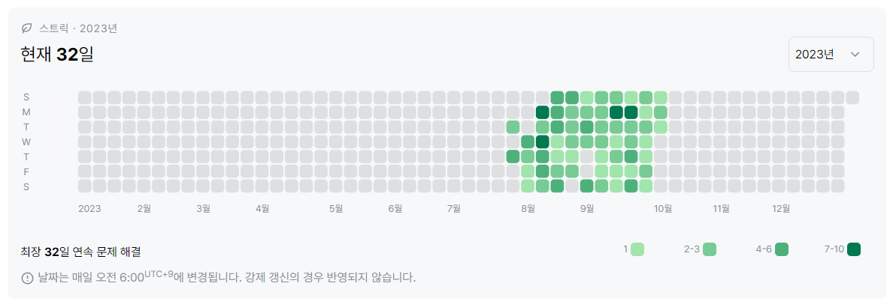
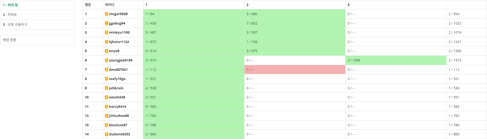

## 2023년 9월 잔디가득심기 스터디 결과 보고서

### 스터디 운영 계획

#### 참석명단 (14명)

- 스터디장 : `조용훈`

- 스터디원 : `권원영` `김대원` `김민규` `김영준` `김재형` `배정식` `송영주` `이재종` `장진희` `최현기` `홍지은` `황준식` `황지환`

#### 스터디 목표

- solved.ac 잔디 가득 심기

- 9월 BOJ **50문제** 풀이
- `평일` 2문제 / 1일 `주말` 1문제 / 1일 (공채 시즌 `평일` 1문제 / 1일)

#### 활동 계획

- 학습 도구 : [백준](https://www.acmicpc.net/)
- 코딩테스트 대비, 알고리즘 분류를 감안하지 않고 코딩 테스트 유사 문제를 풀이
- 어떤 문제를 풀더라도, 구체적인 알고리즘 풀이 방식을 설명하는 주석 삽입
- 학습 초기에는 내장함수 사용 지양

#### 벌금 제도 (9월 6일 부)

- 잔디 탈모 : 3,000원
- 평일 2문제 미풀이 : 2,000원
- 평일 1문제 미풀이 : 1,000원
- 주말 1문제 미풀이 : 2,000원

#### 운영 계획 변경 사항

1. 벌금 제도 변경, 스터디명 취지에 맞게 잔디 심기에 우선 순위를 둠.

   - 기존안
     - 평일 2문제 미풀이 : 3,000원
     - 평일 1문제 미풀이 : 1,000원
     - 주말 1문제 미풀이 : 3,000원
   - 변경안
     - 잔디 탈모 : 3,000원
     - 평일 2문제 미풀이 : 2,000원
     - 평일 1문제 미풀이 : 1,000원
     - 주말 1문제 미풀이 : 2,000원

2. 공채 시즌 기간, 평일 문제풀이 수 1문제로 축소

   

### 스터디 운영 결과

#### 스터디 운영 성과

- `2023. 09` 백준 (solved.ac) 문제 풀이 티어, **14명 전원 골드 달성**
- `2023. 09` 9월 평균 문제 풀이 : 

#### 스터디 운영 느낀점

- SSAFY Python 커리큘럼 상 알고리즘 강의가 끝났기 때문에 문제를 풀기 위해서는 별도로 시간을 내야만 풀이가 가능해졌다. 알고리즘은 손을 놓기 시작하면 금방 감을 잃기 때문에 잔디 심기를 유지하는 것만으로도 충분히 실력을 유지하거나 더 키울 수 있다고 생각했다.
  
- 그러한 관점에서 web 커리큘럼의 과제인 실습을 병행하면서 문제풀이를 진행하는 것은 좀 더 많은 노력을 필요로 하는 상황이었지만 모든 스터디 원들이 열심히 참여해줘서 감사함을 느꼈다.
  
- 백준 (solved.ac) 문제풀이 티어가 실력을 보장하는 것은 아니지만, 충분히 높은 수준의 문제와 그만큼의 양을 충족한다는 측면에서 유의미하다고 생각하는데, 이번 9월 스터디 기간동안 **14명 전원 골드를 달성**했다.
  
- 9월에는 추석 연휴가 있어서 잔디 심기가 어려웠을텐데, 꾸준히 신경써서 문제풀이를 진행해와서 감사했다.
  
- 비전공반이다보니 포트폴리오 준비가 대부분 되어있지 않아 하반기 공채를 준비하는 스터디원은 많이 없지만 앞으로 있을 코딩테스트에 도움이 되면 좋겠다!
  
- 티어가 점차 높아져가고 구현 능력이 올라가는 게 느껴지니까 삼성 SW 역량테스트 B형도 욕심나는데 자바나 C++ 중에 결정해서 코딩 테스트 준비를 해봐야 겠다는 생각도 든다! 정진하자!
  
  
  

#### 잔디 심기 현황

###### 권원영

- 9월 문제 풀이 : 60문제
- 9월 스트릭 유지 : **FULL(30일)**

###### 김대원

- 9월 문제 풀이 : 54문제
- 9월 스트릭 유지 : 29일

###### 김민규

- 9월 문제 풀이 : 70문제
- 9월 스트릭 유지 : **FULL(30일)**

###### 김영준

- 9월 문제 풀이 : 64문제
- 9월 스트릭 유지 : **FULL(30일)**

###### 김재형

- 9월 문제 풀이 : 43문제
- 9월 스트릭 유지 : 21일

###### 배정식

- 9월 문제 풀이 : 67문제
- 9월 스트릭 유지 : **FULL(30일)**

###### 송영주

- 9월 문제 풀이 : 59문제
- 9월 스트릭 유지 : **FULL(30일)**

###### 이재종

- 9월 문제 풀이 : 71문제
- 9월 스트릭 유지 : **FULL(30일)**

###### 장진희

- 9월 문제 풀이 : 54문제
- 9월 스트릭 유지 : **FULL(30일)**

###### 조용훈

- 9월 문제 풀이 : 58문제
- 9월 스트릭 유지 : **FULL(30일)**

###### 최현기

- 9월 문제 풀이 : **107문제**
- 9월 스트릭 유지 : **FULL(30일)**

###### 홍지은

- 9월 문제 풀이 : 56문제
- 9월 스트릭 유지 : **FULL(30일)**

###### 황준식

- 9월 문제 풀이 : 44문제
- 9월 스트릭 유지 : 29일

###### 황지환

- 9월 문제 풀이 : 43문제
- 9월 스트릭 유지 : 27일

### 진행 일정 및 공부한 내용

- `9/1(금) ~ 9/4(월)` [Greedy] BOJ 17문제 출제

  - `9/1(금)` `2.64 / 5` 문제 풀이

    

  - `9/2(토) ~ 9/3(일)`  `2.79 / 8` 문제 풀이

    

  - `9/4(월)`  ` 2.5 / 4` 문제 풀이

    

- `9/5(화) ~ 9/8(금)` [KOI] BOJ 16문제 출제

  - `9/5(화)`  ` 1.87 / 4` 문제 풀이

    

  - `9/6(수)` ` 1.87 / 4` 문제 풀이

    

  - `9/7(목)` `2.07 / 4` 문제 풀이

    

  - `9/8(금)` `1.64 / 4` 문제 풀이

    

- `9/9(토) ~ 9/21(목)` [Test Exrc] BOJ 54문제 출제

  - `9/9(토) ~ 9/10(일)` `2.79 / 8` 문제 풀이

    

  - `9/11(월)` `2.21 / 4` 문제 풀이

    

  - `9/12(화) ` `2.14 / 4` 문제 풀이

    

  - `9/13(수)` `1.57 / 3` 문제 풀이

    

  - `9/14(목)` `1.43 / 3` 문제 풀이

    

  - `9/15(금)` `1.43 / 3` 문제 풀이

    

  - `9/16(토) ~ 9/17(일)` `2.86 / 8` 문제 풀이

    

  - `9/18(월)` `2 / 4` 문제 풀이

    

  - `9/19(화)` `2.07 / 4` 문제 풀이

    

  - `9/20(수)` `2.14 / 4` 문제 풀이

    

  - `9/21(목) ``2.21 / 4` 문제 풀이

    

- `9/22(금)` [Dijkstra] BOJ 4문제 출제

  - `9/22(금)` `2.86 / 4` 문제 풀이

    

- `9/23(토) ~ 10/3(화)` BOJ 37문제 출제

  - `9/23(토) ~ 9/24(일)` `4.5 / 10` 문제 풀이

    

  - `9/25(월)` `2.14 / 4` 문제 풀이

    

  - `9/26(화)` `1.93 / 4` 문제 풀이

    

  - `9/27(수)` `1.57 / 4` 문제 풀이

    

  - `9/28(목) ~ 10/3(화)` `7.5 / 15` 문제 풀이

    

    